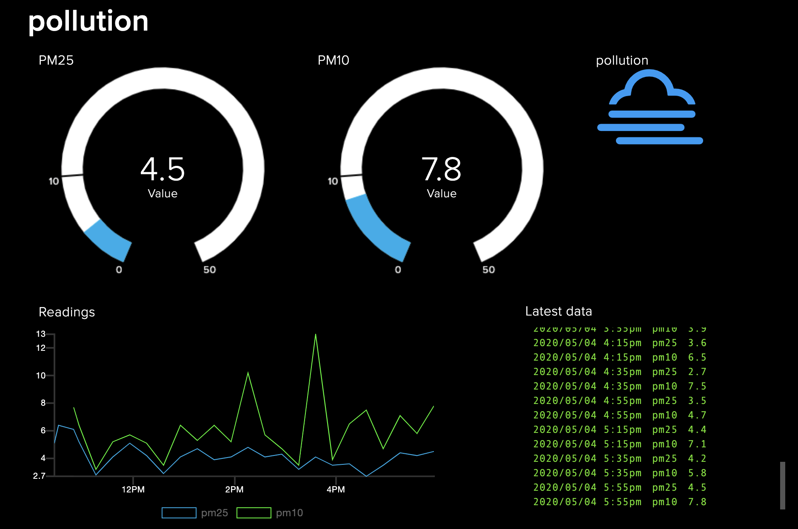

# lambda_to_adafruitIO
Uses cloud watch events to push IoT data from dynamodb to Adafruit IO. I use this on one of my projects to take copy readings that get put into dynamodb by AWS IoT Core from my pollution monitoing device, so that I can graph them in AdaFruit IO (for free).

## Prerequisites
* A free account on Adafruit.io

## Getting started
* edit lambda_handler.py and replace the values for YOUR_ACCOUNT and YOUR_ADAFRUIT_KEY with the values from your Adafruit account.
* Go create a feed for the item you want to log the data of. In my case I created 2 henc the slighlty weird code in the handler - one for PM25 reading and one for PM10 readings from the pollution sensor and I called my feeds obviously PM25 and PM10. Name yours whatever you want
* Fix the query in the lambda to get whatever data your using in dynamodb
* Check it works with a test (you can also do a curl POST first from your command line to check) something like this:
curl -F 'value=WHATEVER_VALUE_YOU_WANT_TO_POST' -H "X-AIO-Key: YOUR_ADAFRUIT_KEY" https://io.adafruit.com/api/v2/YOUR_ACCOUNT/feeds/YOUR_FEED_NAME/data
* Create a Cloudwatch event - mines a schedule every 20 minutes

## What does it look like?
My ddashboard looks like this:

